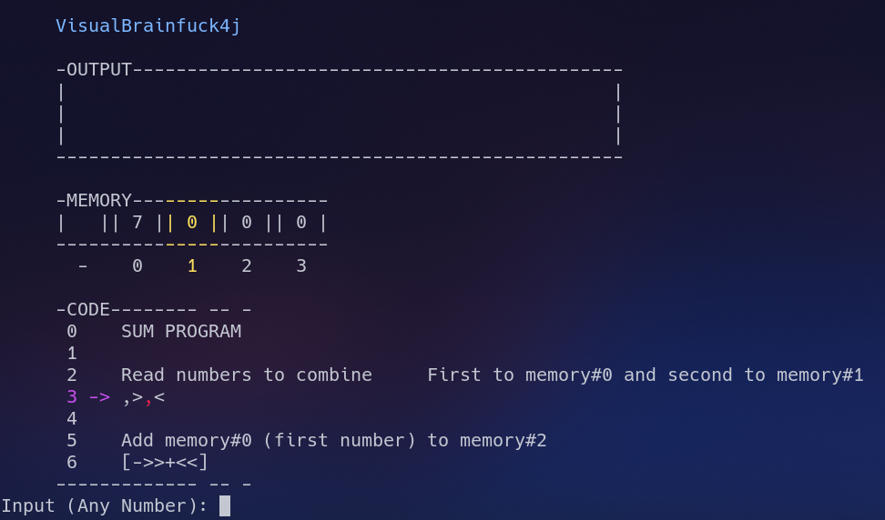

# VisualBrainfuck4j

A brainfuck interpreter that lets you see the live code execution



## Usage

```
 -h, -help                         Shows this help message
 
 -i, -input <file>                 Path to your code
 
 -cs, -clockspeed <milliseconds>   How long the interpreter should wait
                                   between actions in milliseconds (100ms
                                   default)
                                   
 -cm, -charmode                    Switches to char mode. Input and output
                                   will be the corresponding numbers to
                                   the charachters and in reverse. Default
                                   is number mode which means input and
                                   output are only numbers
                                   
 -b, -bits <bits>                  How many bits each memory cell should
                                   have (default 8)
 
 -nv, -notvisual                   Run the interpreter without live
                                   output/memory/code display. Output will
                                   be printed after finishing
                                   
 -sj, -softjumping                 Makes the interpreter walk back to the
                                   start of a loop instead of jumping
```

#### Example

`java -jar visualbrainfuck4j.jar -i code.bfck -cs 500`

#### Define arguments in a file

If you dont want to type your args every time, create a file named vbf4j.args in the directory you execute this command
from and paste your args in there. Command line arguments will be ignored.